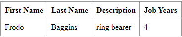
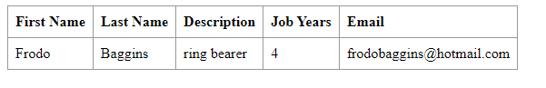

# DevOps | Class Assignment 1 - Technical Report

### Part 1 - Adding a new feature using only the master branch.

This technical report documents the steps taken to fulfill the requirements outlined for CA1, which involves setting up
a React.js and Spring Data REST application, adding a new feature, and versioning the application.

1. Copy the code of the Tutorial React.js and Spring Data REST Application into a new folder named CA1.
2. Commit the changes (and push them).
3. We should use tags to mark the versions of the application. You should use a
   pattern like: major.minor.revision (e.g., 1.1.0).
   Tag the initial version as v1.1.0. Push it to the server.
4. Lets develop a new feature to add a new field to the application. In this case, lets
   add a new field to record the years of the employee in the company (e.g., jobYears).
    * You should add support for the new field.
    * You should also add unit tests for testing the creation of Employees and the validation
      of their attributes (for instance, no null/empty values). For the new field, only integer
      values should be allowed.
    * You should debug the server and client parts of the solution.
    * When the new feature is completed (and tested) the code should be committed and
      pushed and a new tag should be created (e.g, v1.2.0).
5. At the end of the assignment mark your repository with the tag ca1-part1.

### Analysis

1. **Copy the code to CA1 folder**: The primary goal is to integrate the Tutorial React.js and Spring Data REST
   Application code into a new folder named CA1.
2. **Commit and Push Changes**: Commit the changes made during the integration process and push them to the master
   branch.
3. **Versioning with Tags** :Implement versioning for the application using tags, starting with the initial version (
   v1.1.0).
4. **Develop and Test New Feature** :Develop a new feature by adding a 'jobYears' field to the application, implement
   support for it, and conduct thorough testing.
5. **Mark Repository with 'ca1-part1' Tag**: Conclude the assignment by marking the repository with the 'ca1-part1' tag.

### Design

Based on the analysis we can identify the following steps to fulfill the requirements:

- Add a new field to the Employee entity.
- Modify the REST API to support the new field.
- Implement unit tests for creating employees and validating their attributes.
- Identify and fix the issues in both the server and client parts of the solution.
- Commit the changes and create version tags for the initial version and the new feature.

### Setting Up the Project

**Initialize a new Git repository**:

```
    cd CA1
    git init
    git add .
    git commit -m "first commit"
```

**Adding gitignore**:

```
touch.gitignore

# Copied gitignore from gitignore.io

git add .

git commit -m "Added .gitignore"
```

#### Implementation

1. Copy the code to CA1 folder using the following command:

```
#Create a new folder named CA1
   mkdir CA1

#Copy code into CA1 folder
   cp -r Tutorial_React_Spring_Data_REST/* CA1/
```

2. Commit the changes and push them to the master branch:

```
# Navigate to CA1 folder
cd CA1/

# Initialize a new Git repository
git init

# Add and commit changes
git add .
git commit -m "#1 and #2 issues"

# Push changes to the master branch
git push -u origin master
```

3. Versioning with Tags:

```
# Tag the initial version as v1.1.0
git tag v1.1.0

# Push the tag to the server
git push origin v1.1.0
```

4. Develop and Test New Feature:

    - Add a new field 'jobYears' to the Employee entity in the Employee.java file.

```java

public class Employee {


    //Attributes
    private @Id
    @GeneratedValue Long id; // <2>
    private String firstName;
    private String lastName;
    private String description;
    private int jobYears;

    //Constructor
    public Employee(String firstName, String lastName, String description, int jobYears) {
        setFirstName(firstName);
        setLastName(lastName);
        setDescription(description);
        setJobYears(jobYears);
    }

    //Overrides 
    @Override
    public boolean equals(Object o) {
        if (this == o) return true;
        if (o == null || getClass() != o.getClass()) return false;
        Employee employee = (Employee) o;
        return Objects.equals(id, employee.id) &&
                Objects.equals(firstName, employee.firstName) &&
                Objects.equals(lastName, employee.lastName) &&
                Objects.equals(description, employee.description) &&
                jobYears == employee.jobYears;
    }

    @Override
    public int hashCode() {

        return Objects.hash(id, firstName, lastName, description, jobYears);
    }

    @Override
    public String toString() {
        return "Employee{" +
                "id=" + id +
                ", firstName='" + firstName + '\'' +
                ", lastName='" + lastName + '\'' +
                ", description='" + description + '\'' +
                ", jobYears=" + jobYears + '\'' +
                '}';
    }

    //Getters and Setters
    public int getJobYears() {
        return jobYears;
    }

    public void setJobYears(int jobYears) {
        if (jobYears < 0)
            throw new IllegalArgumentException("Job years must be greater than 0.");
        this.jobYears = jobYears;
    }
}
````

- Add a new field 'jobYears' to the DatabaseLoader method

```java

@Component // <1>
public class DatabaseLoader implements CommandLineRunner { // <2>

    @Override
    public void run(String... strings) throws Exception { // <4>
        this.repository.save(new Employee("Frodo", "Baggins", "ring bearer", 4));
    }
}
````

- Modify the REST API to support the new field by adding the necessary annotations to the EmployeeRepository.java file.

```javascript
// tag::employee-list[]
class EmployeeList extends React.Component {
    render() {
        const employees = this.props.employees.map(employee =>
            <Employee key={employee._links.self.href} employee={employee}/>
        );
        return (
            <table>
                <tbody>
                    <tr>
                        <th>First Name</th>
                        <th>Last Name</th>
                        <th>Description</th>
                        <th>Job Years</th>
                        <th>Email</th>
                    </tr>
                    {employees}
                </tbody>
            </table>
        )
    }
}

// end::employee-list[]

// tag::employee[]
class Employee extends React.Component {
    render() {
        return (
            <tr>
                <td>{this.props.employee.firstName}</td>
                <td>{this.props.employee.lastName}</td>
                <td>{this.props.employee.description}</td>
                <td>{this.props.employee.jobYears}</td>
                <td>{this.props.employee.email}</td>
            </tr>
        )
    }
}

// end::employee[]


````

- Implement unit tests for creating employees and validating their attributes in the EmployeeRepositoryTests.java file.º

```java
public class EmployeeTests {

    /**
     * Test of Employee constructor, of class Employee.
     */
    @Test
    public void testEmployee() {
        //Arrange
        String firstName = "Frodo";
        String lastName = "Baggins";
        String description = "ring bearer";
        int jobYears = 4;


        //Act
        Employee employee = new Employee(firstName, lastName, description, jobYears);

        //Assert
        assertNotNull(employee);
    }

    /**
     * Test of Employee getters, of class Employee.
     */

    @Test
    public void testEmployeeGetters() {
        //Arrange
        String firstName = "Frodo";
        String lastName = "Baggins";
        String description = "ring bearer";
        int jobYears = 4;

        //Act
        Employee employee = new Employee(firstName, lastName, description, jobYears);

        //Assert
        assertEquals(firstName, employee.getFirstName());
        assertEquals(lastName, employee.getLastName());
        assertEquals(description, employee.getDescription());
        assertEquals(jobYears, employee.getJobYears());
    }

    /**
     * Test of Employee if exception is thrown, of class Employee, when first name is null.
     */
    @Test
    public void testExceptionNullFirstName() {
        //Arrange
        String firstName = null;
        String lastName = "Baggins";
        String description = "ring bearer";
        int jobYears = 4;

        String exceptionMessage = "First name must not be null or empty.";

        //Act + Assert
        Exception exception = assertThrows(IllegalArgumentException.class, () -> {
            new Employee(firstName, lastName, description, jobYears);
        });
        assertEquals(exceptionMessage, exception.getMessage());
    }

    /**
     * Test of Employee if exception is thrown, of class Employee, when first name is empty.
     */
    @Test
    public void testExceptionEmptyFirstName() {
        //Arrange
        String firstName = "";
        String lastName = "Baggins";
        String description = "ring bearer";
        int jobYears = 4;

        String exceptionMessage = "First name must not be null or empty.";

        //Act + Assert
        Exception exception = assertThrows(IllegalArgumentException.class, () -> {
            new Employee(firstName, lastName, description, jobYears);
        });
        assertEquals(exceptionMessage, exception.getMessage());
    }

    /**
     * est of Employee if exception is thrown, of class Employee, when last name is null.
     */
    @Test
    public void testExceptionNullLastName() {
        //Arrange
        String firstName = "Frodo";
        String lastName = null;
        String description = "ring bearer";
        int jobYears = 4;

        String exceptionMessage = "Last name must not be null or empty.";

        //Act + Assert
        Exception exception = assertThrows(IllegalArgumentException.class, () -> {
            new Employee(firstName, lastName, description, jobYears);
        });
        assertEquals(exceptionMessage, exception.getMessage());
    }

    /**
     * Test of Employee if exception is thrown, of class Employee, when last name is empty.
     */
    @Test
    public void testExceptionEmptyLastName() {
        //Arrange
        String firstName = "Frodo";
        String lastName = "";
        String description = "ring bearer";
        int jobYears = 4;

        String exceptionMessage = "Last name must not be null or empty.";

        //Act + Assert
        Exception exception = assertThrows(IllegalArgumentException.class, () -> {
            new Employee(firstName, lastName, description, jobYears);
        });
        assertEquals(exceptionMessage, exception.getMessage());
    }

    /**
     * Test of Employee if exception is thrown, of class Employee, when description is null.
     */
    @Test
    public void testExceptionNullDescription() {
        //Arrange
        String firstName = "Frodo";
        String lastName = "Baggins";
        String description = null;
        int jobYears = 4;

        String exceptionMessage = "Description must not be null or empty.";

        //Act + Assert
        Exception exception = assertThrows(IllegalArgumentException.class, () -> {
            new Employee(firstName, lastName, description, jobYears);
        });
        assertEquals(exceptionMessage, exception.getMessage());
    }

    /**
     * Test of Employee if exception is thrown, of class Employee, when description is empty.
     */
    @Test
    public void testExceptionEmptyDescription() {
        //Arrange
        String firstName = "Frodo";
        String lastName = "Baggins";
        String description = "";
        int jobYears = 4;

        String exceptionMessage = "Description must not be null or empty.";

        //Act + Assert
        Exception exception = assertThrows(IllegalArgumentException.class, () -> {
            new Employee(firstName, lastName, description, jobYears);
        });
        assertEquals(exceptionMessage, exception.getMessage());
    }

    /**
     * Test of Employee if exception is thrown, of class Employee, when jobYears is lower than 0.
     */
    @Test
    public void testExceptionNullJobYearsLowerThanZero() {
        //Arrange
        String firstName = "Frodo";
        String lastName = "Baggins";
        String description = "ring bearer";
        int jobYears = -15;

        String exceptionMessage = "Job years must be greater than 0.";

        //Act + Assert
        Exception exception = assertThrows(IllegalArgumentException.class, () -> {
            new Employee(firstName, lastName, description);
        });
        assertEquals(exceptionMessage, exception.getMessage());
    }
}
````

- Running the app and debuging the server and client parts of the solution:

```bash
# Run the app
./mvnw spring-boot:run
```

- Accessing the app at http://localhost:8080/ and checking the new feature:
  

- Commit the changes and create a new tag for the new feature:

```
# Add and commit changes
git add .

# Commit the changes
git commit -m "#1 and #2 issues"

//added untrackedfiles 
# Tag the new feature as v1.2.0
git tag v1.2.0

# Push the tag to the server
git push origin v1.2.0

# Mark the repository with the 'ca1-part1' tag
git tag ca1-part1

# Push the tag to the server
git push origin ca1-part1
```

### Conclusion

This technical report has documented the steps taken to fulfill the requirements outlined for CA1, which involved
setting up a React.js and Spring Data REST application, adding a new feature, and versioning the application. The new
feature involved adding a 'jobYears' field to the application, implementing support for it, and conducting thorough
testing. The server and client parts of the solution were debugged, and the changes were committed and tagged. The
repository was marked with the 'ca1-part1' tag to conclude the assignment.

### Part 2 - Implementing a simple scenario illustrating a simple git workflow using branches.

This technical report outlines the steps and decisions made in implementing a simple Git workflow for the second part of
the CA1 assignment. The focus is on branching, developing new features, fixing bugs, and versioning using Git commands.
The tutorial-style format ensures easy reproducibility by following the provided instructions.

1. You should use the master branch to ”publish” the ”stable” versions of the Tutorial React.js and Spring Data REST
   Application.
2. You should develop new features in branches named after the feature. Create a
   branch named ”email-field” to add a new email field to the application.

- You should create a branch called email-field.
- You should add support for the email field.
- You should also add unit tests for testing the creation of Employees and the validation of their attributes (for
  instance, no null/empty values).
- You should debug the server and client parts of the solution.
- When the new feature is completed (and tested) the code should be merged with the
  master and a new tag should be created (e.g, v1.3.0).

3. You should also create branches for fixing bugs (e.g., ”fix-invalid-email”):

- Create a branch called fix-invalid-email. The server should only accept Employees with a valid email (e.g., an email
  must have the ”@” sign).
- You should debug the server and client parts of the solution.
- When the fix is completed (and tested) the code should be merged into master and a
  new tag should be created (with a change in the minor number, e.g., v1.3.0 -> v1.3.1)

4. At the end of the assignment mark your repository with the tag "ca1-part2"

### Analysis

1. **Publish Stable Versions**: Use the master branch to publish stable versions of the application.
2. **Develop New Features in Branches**: Create a branch named 'email-field' to add a new email field to the
   application. Add support for the email field, add unit tests, debug the server and client parts of the solution,
   merge the feature with the master, and create a new tag (v1.3.0).
3. **Create Branches for Fixing Bugs**: Create a branch called 'fix-invalid-email' to fix the issue of the server only
   accepting employees with a valid email. Debug the server and client parts of the solution, merge the fix with the
   master, and create a new tag (v1.3.1).
4. **Mark Repository with 'ca1-part2' Tag**: Conclude the assignment by marking the repository with the 'ca1-part2' tag.

### Design

Based on the analysis, the following steps are identified to fulfill the requirements:

- Publish stable versions of the application using the master branch.
- Develop new features in branches named after the feature.
- Create a branch named 'email-field' to add a new email field to the application.
- Add support for the email field, add unit tests, and debug the server and client parts of the solution.
- Merge the feature with the master and create a new tag (v1.3.0).
- Create a branch called 'fix-invalid-email' to fix the issue of the server only accepting employees with a valid email.
- Debug the server and client parts of the solution, merge the fix with the master, and create a new tag (v1.3.1).
- Mark the repository with the 'ca1-part2' tag to conclude the assignment.

### Implementation

1. Publish Stable Versions:

    - Use the master branch to publish stable versions of the application.

```
   # Ensure you are on the master branch
git checkout main

# Confirm you have the latest changes
git pull origin main
```

2. Develop New Features in Branches:

    - Create a branch named 'email-field'.

```
# Create a branch named 'email-field'
git checkout -b email-field
```

- Add support for the email field, add unit tests, and debug the server and client parts of the solution.

```java
   public class Employee {

    //Attributes
    private @Id
    @GeneratedValue Long id; // <2>
    private String firstName;
    private String lastName;
    private String description;
    private int jobYears;
    private String email;

    //Constructor
    public Employee(String firstName, String lastName, String description, int jobYears, String email) {
        setFirstName(firstName);
        setLastName(lastName);
        setDescription(description);
        setJobYears(jobYears);
        setEmail(email);
    }

    //Overrides
    @Override
    public boolean equals(Object o) {
        if (this == o) return true;
        if (o == null || getClass() != o.getClass()) return false;
        Employee employee = (Employee) o;
        return Objects.equals(id, employee.id) &&
                Objects.equals(firstName, employee.firstName) &&
                Objects.equals(lastName, employee.lastName) &&
                Objects.equals(description, employee.description) &&
                jobYears == employee.jobYears &&
                Objects.equals(email, employee.email);
    }

    @Override
    public int hashCode() {

        return Objects.hash(id, firstName, lastName, description, jobYears, email);
    }

    @Override
    public String toString() {
        return "Employee{" +
                "id=" + id +
                ", firstName='" + firstName + '\'' +
                ", lastName='" + lastName + '\'' +
                ", description='" + description + '\'' +
                ", jobYears=" + jobYears + '\'' +
                ", email=" + email +
                '}';
    }

    //Getters and Setters
    public String getEmail() {
        return email;
    }

    public void setEmail(String email) {
        if (email == null || email.isEmpty()) {
            this.email = email;
        }
    }
}
````

- Add a new field 'email' to the DatabaseLoader method

```java

@Component // <1>
public class DatabaseLoader implements CommandLineRunner { // <2>

    @Override
    public void run(String... strings) throws Exception { // <4>
        this.repository.save(new Employee("Frodo", "Baggins", "ring bearer", 4, "frodobaggins@hotmail.com"));
    }
}
````

- Modify the REST API to support the new field by adding the necessary annotations to the EmployeeRepository.java file.

```javascript

// tag::employee-list[]
class EmployeeList extends React.Component {
    render() {
        const employees = this.props.employees.map(employee =>
            <Employee key={employee._links.self.href} employee={employee}/>
        );
        return (
            <table>
                <tbody>
                    <tr>
                        <th>First Name</th>
                        <th>Last Name</th>
                        <th>Description</th>
                        <th>Job Years</th>
                        <th>Email</th>
                    </tr>
                    {employees}
                </tbody>
            </table>
        )
    }
}

// end::employee-list[]

// tag::employee[]
class Employee extends React.Component {
    render() {
        return (
            <tr>
                <td>{this.props.employee.firstName}</td>
                <td>{this.props.employee.lastName}</td>
                <td>{this.props.employee.description}</td>
                <td>{this.props.employee.jobYears}</td>
                <td>{this.props.employee.email}</td>
            </tr>
        )
    }
}

// end::employee[]
````

- Implement unit tests for creating employees and validating their attributes in the EmployeeRepositoryTests.java file.

```java
    //Tests 
public class EmployeeTests {

    /**
     * Test of Employee constructor, of class Employee.
     */
    @Test
    public void testEmployee() {
        //Arrange
        String firstName = "Frodo";
        String lastName = "Baggins";
        String description = "ring bearer";
        int jobYears = 4;
        String email = "frodobaggins@hotmail.com";


        //Act
        Employee employee = new Employee(firstName, lastName, description, jobYears, email);

        //Assert
        assertNotNull(employee);
    }

    /**
     * Test of Employee getters, of class Employee.
     */
    @Test
    public void testEmployeeGetters() {
        //Arrange
        String firstName = "Frodo";
        String lastName = "Baggins";
        String description = "ring bearer";
        int jobYears = 4;
        String email = "frodobaggins@hotmail.com";

        //Act
        Employee employee = new Employee(firstName, lastName, description, jobYears, email);

        //Assert
        assertEquals(firstName, employee.getFirstName());
        assertEquals(lastName, employee.getLastName());
        assertEquals(description, employee.getDescription());
        assertEquals(jobYears, employee.getJobYears());
    }

    /**
     * Test of Employee if exception is thrown, of class Employee, when first name is null.
     */
    @Test
    public void testExceptionNullFirstName() {
        //Arrange
        String firstName = null;
        String lastName = "Baggins";
        String description = "ring bearer";
        int jobYears = 4;
        String email = "frodobaggins@hotmail.com";

        String exceptionMessage = "First name must not be null or empty.";

        //Act + Assert
        Exception exception = assertThrows(IllegalArgumentException.class, () -> {
            new Employee(firstName, lastName, description, jobYears, email);
        });
        assertEquals(exceptionMessage, exception.getMessage());
    }

    /**
     * Test of Employee if exception is thrown, of class Employee, when first name is empty.
     */
    @Test
    public void testExceptionEmptyFirstName() {
        //Arrange
        String firstName = "";
        String lastName = "Baggins";
        String description = "ring bearer";
        int jobYears = 4;
        String email = "frodobaggins@hotmail.com";

        String exceptionMessage = "First name must not be null or empty.";

        //Act + Assert
        Exception exception = assertThrows(IllegalArgumentException.class, () -> {
            new Employee(firstName, lastName, description, jobYears, email);
        });
        assertEquals(exceptionMessage, exception.getMessage());
    }

    /**
     * est of Employee if exception is thrown, of class Employee, when last name is null.
     */
    @Test
    public void testExceptionNullLastName() {
        //Arrange
        String firstName = "Frodo";
        String lastName = null;
        String description = "ring bearer";
        int jobYears = 4;
        String email = "frodobaggins@hotmail.com";

        String exceptionMessage = "Last name must not be null or empty.";

        //Act + Assert
        Exception exception = assertThrows(IllegalArgumentException.class, () -> {
            new Employee(firstName, lastName, description, jobYears, email);
        });
        assertEquals(exceptionMessage, exception.getMessage());
    }

    /**
     * Test of Employee if exception is thrown, of class Employee, when last name is empty.
     */
    @Test
    public void testExceptionEmptyLastName() {
        //Arrange
        String firstName = "Frodo";
        String lastName = "";
        String description = "ring bearer";
        int jobYears = 4;
        String email = "frodobaggins@hotmail.com";

        String exceptionMessage = "Last name must not be null or empty.";

        //Act + Assert
        Exception exception = assertThrows(IllegalArgumentException.class, () -> {
            new Employee(firstName, lastName, description, jobYears, email);
        });
        assertEquals(exceptionMessage, exception.getMessage());
    }

    /**
     * Test of Employee if exception is thrown, of class Employee, when description is null.
     */
    @Test
    public void testExceptionNullDescription() {
        //Arrange
        String firstName = "Frodo";
        String lastName = "Baggins";
        String description = null;
        int jobYears = 4;
        String email = "frodobaggins@hotmail.com";

        String exceptionMessage = "Description must not be null or empty.";

        //Act + Assert
        Exception exception = assertThrows(IllegalArgumentException.class, () -> {
            new Employee(firstName, lastName, description, jobYears, email);
        });
        assertEquals(exceptionMessage, exception.getMessage());
    }

    /**
     * Test of Employee if exception is thrown, of class Employee, when description is empty.
     */
    @Test
    public void testExceptionEmptyDescription() {
        //Arrange
        String firstName = "Frodo";
        String lastName = "Baggins";
        String description = "";
        int jobYears = 4;
        String email = "frodobaggins@hotmail.com";

        String exceptionMessage = "Description must not be null or empty.";

        //Act + Assert
        Exception exception = assertThrows(IllegalArgumentException.class, () -> {
            new Employee(firstName, lastName, description, jobYears, email);
        });
        assertEquals(exceptionMessage, exception.getMessage());
    }

    /**
     * Test of Employee if exception is thrown, of class Employee, when jobYears is lower than 0.
     */
    @Test
    public void testExceptionNullJobYearsLowerThanZero() {
        //Arrange
        String firstName = "Frodo";
        String lastName = "Baggins";
        String description = "ring bearer";
        int jobYears = -15;
        String email = "frodobaggins@hotmail.com";

        String exceptionMessage = "Job years must be greater than 0.";

        //Act + Assert
        Exception exception = assertThrows(IllegalArgumentException.class, () -> {
            new Employee(firstName, lastName, description, jobYears, email);
        });
        assertEquals(exceptionMessage, exception.getMessage());
    }

    /**
     * Test of Employee if exception is thrown, of class Employee, when email is null.
     */

    @Test
    public void testExceptionNullEmail() {
        //Arrange
        String firstName = "Frodo";
        String lastName = "Baggins";
        String description = "ring bearer";
        int jobYears = 4;
        String email = null;

        String exceptionMessage = "Invalid input";

        //Act + Assert
        Exception exception = assertThrows(IllegalArgumentException.class, () -> {
            new Employee(firstName, lastName, description, jobYears, email);
        });
        assertEquals(exceptionMessage, exception.getMessage());
    }

    /**
     * Test of Employee if exception is thrown, of class Employee, when email is empty.
     */
    @Test
    public void testExceptionEmptyEmail() {
        //Arrange
        String firstName = "Frodo";
        String lastName = "Baggins";
        String description = "ring bearer";
        int jobYears = 4;
        String email = "";

        String exceptionMessage = "Invalid input";

        //Act + Assert
        Exception exception = assertThrows(IllegalArgumentException.class, () -> {
            new Employee(firstName, lastName, description, jobYears, email);
        });
        assertEquals(exceptionMessage, exception.getMessage());
    }
}

````

- Merge the feature with the master and create a new tag (v1.3.0):

```
# Commit the changes
git commit -m "#4 - Added tests to email field validation"

# Switch to the master branch
git checkout main

# Merge the 'email-field' branch with the master
git merge email-field

# Tag the new feature as v1.3.0
git tag v1.3.0

# Push the tag to the server
git push origin v1.3.0

````

3. Create Branches for Fixing Bugs:

    - Create a branch called 'fix-invalid-email' to fix the issue of the server only accepting employees with a valid
      email.

```
# Create a branch called 'fix-invalid-email'
git checkout -b fix-invalid-email
```

- Debug the server and client parts of the solution.

```java
public void setEmail(String email) {
    if (email == null || email.isEmpty() || !email.contains("@"))
        throw new IllegalArgumentException("Invalid input");

    String emailRegex = "^[a-zA-Z0-9._%+-]+@[a-zA-Z0-9.-]+\\.[a-zA-Z]{2,6}$";
    Pattern pattern = Pattern.compile(emailRegex);
    Matcher matcher = pattern.matcher(email);

    if (!matcher.matches()) {
        throw new IllegalArgumentException("Invalid email format");
    }

    this.email = email;
}
`````

- Run the app and debug the server and client parts of the solution:
    ```bash
    # Run the app
    ./mvnw spring-boot:run
    ```

- Access the app at http://localhost:8080/ and check the new feature:



- Merge the fix with the master and create a new tag (v1.3.1):

```
# Commit the changes
git commit -m "#5 - Fix invalid email and respective tests"

# Switch to the master branch
git checkout main

# Merge the 'fix-invalid-email' branch with the master
git merge fix-invalid-email

# Tag the fix as v1.3.1
git tag v1.3.1

# Push the tag to the server
git push origin v1.3.1

# Mark the repository with the 'ca1-part2' tag
git tag ca1-part2

# Push the tag to the server
git push origin ca1-part2

````

### Conclusion

This technical report has documented the steps and decisions made in implementing a simple Git workflow for the second
part of the CA1 assignment. The focus was on branching, developing new features, fixing bugs, and versioning using Git
commands. The tutorial-style format ensures easy reproducibility by following the provided instructions. The repository
was marked with the 'ca1-part2' tag to conclude the assignment. The new features and bug fixes were successfully
implemented and versioned using Git commands.


Part 3 - Part 3 - With Subversion commands, add a new feature to a React.js and Spring Data REST Application using branches
-----------------------------------------------------------------------------------------------------------------------------------------------------------
In the third segment of this report, we will describe the procedure of incorporating a new feature into an existing React.js and Spring Data REST application. We will use Subversion (SVN) as our version control system, as an alternative to Git. We will use branches for the development and integration of the new feature. The new feature we will be introducing is the ability to record the years of experience of employees in the company. We will follow a systematic approach to analyze, design, and implement this feature.

### Requirements
1. Establish a new Subversion repository named "CA1".
2. Import the existing application codebase into the repository.
3. Implement a version tagging scheme (e.g., major.minor.revision) and tag the initial version as v1.1.0.
4. Develop a new feature within a dedicated branch. The feature involves adding a "jobYears" field to the Employee entity in the application. Unit tests and debugging for both server and client components are essential.
5. Upon successful development and testing, merge the feature branch back to the main codebase (trunk) and create a new version tag, such as v1.2.0.
5. Mark the repository with a final tag named "ca1-part3" at the assignment's completion.
6. Utilize Subversion's built-in issue tracking capabilities to streamline task and update management.

### Analysis

Breaking Down the Requirements: A Road Map for Feature Implementation
Before diving into the code, let's take a step back and examine the requirements like a map, planning our journey towards a successful feature implementation. Here's a breakdown of the key components and tasks involved:

1. **Setting Up Our Workspace**:
   - We'll establish a brand new repository, a dedicated storage space for our project.
   - Next, we'll import the existing codebase of the React.js and Spring Data REST application, bringing all the necessary components into our repository.
   
2. **Version Tagging**: To track progress and maintain version control, we'll tag the initial version of the codebase as v1.1.0. This will serve as a reference point for future development and changes.

3. **Building the New Feature**:
   - To isolate the development of the "years-of-experience" feature, we'll create a separate branch named "years-of-experience." This will allow us to work on the new feature without affecting the main codebase.
   - Within this branch, we'll introduce a new field named "jobYears" to the Employee entity, enabling us to capture employee experience data.
   - To ensure data integrity, we'll write unit tests to validate employee creation and confirm proper attribute validation, specifically focusing on the newly added "jobYears" field. This helps us catch errors early on.
   - After implementing the feature, we'll meticulously debug both the server and client components of the application to identify and address any potential issues.
   - Once everything is functioning as intended, we'll merge the changes from the feature branch back into the main codebase (trunk), effectively integrating the new functionality. To mark the completion of this step, we'll create a new tag, v1.2.0, for the merged version in the trunk.
   
4. **Final Tagging**: With the feature fully implemented and tested, we'll create a final tag named "ca1-part3" for the repository. This tag signifies the accomplishment of this assignment.

### Design
Based on the analysis, here's the design for implementing the new feature:

1. **Create Feature Branch**: We'll begin by creating a dedicated branch named "years-of-experience." This branch will serve as a distinct workspace for developing the new feature, keeping it isolated from the main codebase (trunk).

2. **Modify Entity**: Within the newly created branch, we'll introduce a fresh field, "jobYears," to the Employee entity. This field will capture valuable data about an employee's years of experience.

3. **Unit Testing**: To guarantee the new functionality operates flawlessly, we'll construct unit tests. These tests will validate employee creation, attribute validation, and specifically focus on the proper behavior of the "jobYears" field. This proactive approach helps us identify and fix any issues early in the development cycle.

4. **Debugging**: After implementing the feature, we'll meticulously comb through both the server and client components of the application. This debugging phase is crucial for uncovering and resolving any potential problems that might arise.

5. **Merge to Trunk**: Once everything is functioning as intended, we'll merge the changes from the feature branch back into the main codebase (trunk). This effectively integrates the "years-of-experience" feature into the core application.

6. **Version Tagging**: To signify the successful completion of the feature implementation, we'll create a new tag named v1.2.0 for the merged version in the trunk. This tag serves as a reference point for this significant milestone.

7. **Final Tagging**:  Finally, to mark the achievement of this entire assignment, we'll create a final tag named "ca1-part3" for the repository. This tag signifies the culmination of our efforts.

By following these well-defined steps, we'll establish a structured and controlled environment for feature development, ensuring seamless integration and maintaining clear version control throughout the process.

### Implementation
From the analysis, the steps to implement the new feature are as follows:

1. **Repository Setup**:
   * Create a new repository named "ca1" in Subversion.
   * Import the existing codebase of the React.js and Spring Data REST application
     into the repository.
```bash
   svnadmin create ca1
   svn import c/users/user/Documents/TutorialReactSpringApp/ ca1 -m "Initial import"
```

2. **Version Tagging**:
   * Tag the initial version as v1.1.0.
```bash
   svn copy ^/trunk ^/tags/v1.1.0 -m "Tagging initial version as v1.1.0"
```

3. **New Feature Development**:
   * Create a feature branch named "years-of-experience".
   * Switch the new branch and implement the new feature.
 ```bash
    svn copy ^/trunk ^/branches/years-of-experience -m "Creating feature branch for years-of-experience"
    svn switch ^/branches/years-of-experience
 ```
The remaining steps for modifying the entity, implementing unit tests, and debugging,
are the same as in Part 1 of this report, so they won't be represented here.

4. **Merge to Trunk and tagging**:
   * Once the feature development is complete and tested, merge the feature branch
     to the trunk.
```bash
   # Switch to the trunk to merge the feature branch
   svn switch ^/trunk
   svn merge ^/branches/years-of-experience
   svn commit -m "Merged years-of-experience feature branch to trunk"
   
    # Tag the new version
   svn copy ^/trunk ^/tags/v1.2.0 -m "Tagging new version as v1.2.0"
```

5. **Final Tagging**:
   * Mark the repository with the tag "ca1-part3" at the end of the assignment.
```bash
   svn copy ^/trunk ^/tags/ca1-part3 -m "Tagging repository as ca1-part3"
```

Conclusion
-----------
This report has outlined the process of adding new features to a React.js and Spring Data REST application, focusing on version control with both Git and Subversion. Through three sections, we've explored, designed, and implemented functionalities like recording employee years of experience and email addresses. Additionally, we addressed bugs related to invalid email validation.

### Version Control Showdown: Git vs. Subversion

Both Git and Subversion provide powerful version control capabilities, but each has distinct advantages and drawbacks.


### Git
#### Pros:
1. **Distributed Power**: Git operates on a distributed model, allowing for flexible workflows and offline access to the repository.
2. **Branching Mastery**: Git's robust branching and merging capabilities facilitate efficient feature development and collaboration.
3. **Speedy Performance**: Git excels in speed, making operations like commits, merges, and branching quick and responsive.

#### Cons:
1. **Learning Curve**: Git has a steeper learning curve, especially for beginners, due to its extensive features and complex terminology.
2. **Command Complexity**: Git commands can be verbose and intricate, requiring users to memorize them or frequently consult documentation.

### Subversion
#### Pros:
1. **Centralized Comfort**: Subversion follows a centralized model, making it easier to understand and manage for users familiar with traditional version control systems.
2. **Simplicity Reigns**: Subversion's commands are often simpler and more intuitive compared to Git, easing the onboarding process for new users.
3. **History in Focus**: Subversion provides strong history tracking capabilities, allowing effortless tracing of changes and revisions.

#### Cons:
1. **Single Point of Failure**: Subversion's centralized model can become a single point of failure if the central repository goes offline or becomes inaccessible
2. **Performance Lag**: Subversion can be slower than Git, particularly for branching and merging operations, as it relies heavily on server communication.

The Final Verdict

Both Git and Subversion have their merits and limitations. Git's distributed nature and powerful branching make it ideal for complex development workflows and large teams, despite its learning curve. On the other hand, Subversion's simplicity and centralized model offer a more accessible option for smaller teams or those transitioning from traditional version control systems, although it may lack some of Git's advanced features and performance optimizations.