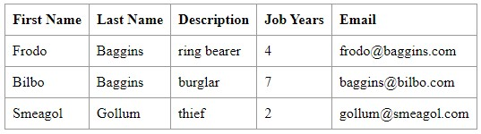

# DevOps | Class Assignment 2 - Part 2

## Technical Report

### Part 2 - Build Tools with Gradle: Convert basic version of the Tutorial application to Gradle.

In this segment of the task, we'll be migrating the basic version of the Tutorial application from Maven to Gradle. This process entails establishing a fresh branch within your repository, titled tut-basic-gradle, which will solely cater to this particular phase of the assignment.

### Requirements

1. Create a new branch in your repository named tut-basic-gradle.
2. Start a new gradle spring boot project with the following dependencies: Rest Repositories, Thymeleaf, JPA and H2.
3. Extract the generated zip file into the folder "CA2/part2" of your repository. Then, check  the available gradle tasks.
4. Delete the src folder, and copy the src folder from the basic folder of the tutorial into the new folder.
   a. Copy the files webpack.config.js and package.json;
   b. Delete the folder src/main/resources/static/built/;
5. Add the gradle plugin org.siouan.frontend to the project.
6. Add "org.siouan.frontend-jdk17" version "8.0.0"
7. Configure the plugin in build.gradle.
8. Update the scripts section in package.json to configure the execution of webpack.
9. Add a task to gradle to copy the generated jar.
10. Add a task to gradle to delete all the files generated by webpack.

### Analysis

1. Create a new branch in your repository named tut-basic-gradle. This action pertains to managing version control via Git. 
   * It serves to segregate alterations made during the migration procedure, thereby safeguarding the primary branch of the project from any potential impact.


2. Start a new gradle spring boot project with the following dependencies: Rest Repositories, Thymeleaf, JPA and H2. This task entails setting up a new Spring Boot project utilizing Gradle as the build tool.
   * These designated dependencies facilitate the development of RESTful APIs, the rendering of server-side HTML views, data persistence through the Java Persistence API (JPA), and utilize H2 as an in-memory database.


3. Unzip the generated file and transfer its contents into the directory "CA2/part2" within your repository. Subsequently, examine the assortment of Gradle tasks accessible.

   * This procedure encompasses unpacking the project files from the provided zip archive and assessing the spectrum of Gradle tasks at your disposal. Such examination aids in comprehending the build sequence within the new Gradle project.
  
 
4. Erase the "src" directory, then duplicate the "src" folder from the basic tutorial folder into the newly emptied directory.
   * This process entails substituting the source code of the fresh Gradle project with the source code derived from the fundamental version of the tutorial application.
   * 

5. Incorporate the Gradle plugin org.siouan.frontend into the project.
   * This action entails integrating a Gradle plugin that furnishes functionalities to manage frontend resources within a Java project. The plugin facilitates the installation of Node.js and npm, along with executing npm and npx commands.


6. Include the dependency "org.siouan.frontend-jdk17" version "8.0.0".
   * This task entails defining the version of the frontend plugin to utilize. The version "8.0.0" has been verified for compatibility with JDK 17.


7. Customize the frontend plugin settings in the build.gradle file to align with project requirements. 
   * This may include specifying the Node.js version, npm version, and defining scripts to execute.


8. Adjust the scripts section within package.json to configure webpack, a powerful static module bundler for JavaScript applications. 
   * This ensures seamless integration and management of frontend assets.


9. Implement a Gradle task to facilitate the copying of the produced JAR file to a designated location. 
   * This enhances the deployment and distribution workflow by simplifying the process of accessing the generated artifact.


10. Introduce a Gradle task designed to remove all files generated by webpack.
    * By incorporating this task into the build process, it ensures a clean environment before initiating subsequent builds, thereby minimizing potential conflicts and errors.


### Design

The migration process from Maven to Gradle for the basic version of the Tutorial application involves the following steps:

1. **Branch Creation**: Establish a new branch within the repository, named tut-basic-gradle. This branch serves to isolate the alterations made during the migration, preventing interference with the main branch.

2. **Project Initialization**: Initialize a fresh Spring Boot project utilizing Gradle as the primary build automation tool. Ensure that the project incorporates essential dependencies such as Rest Repositories, Thymeleaf, JPA, and H2.

3. **Project Setup**: Extract the contents of the generated zip file into the designated directory "CA2/part2" within the repository. Thoroughly examine the available Gradle tasks to comprehend the project's build lifecycle.

4. **Source Code Replacement**: Remove the src directory from the newly created Gradle project and replace it with the src directory obtained from the basic version of the tutorial application. Additionally, transfer the webpack.config.js and package.json files, while also deleting the src/main/resources/static/built/ directory.

5. **Plugin Integration**: Incorporate the Gradle plugin org.siouan.frontend into the project. This plugin offers functionalities to manage frontend resources efficiently within a Java-based project.

6. **Plugin Version Specification**: Specify the version of the frontend plugin to utilize. Ensure compatibility by selecting version "8.0.0," which is compatible with JDK 17.

7. **Plugin Configuration**: Configure the frontend plugin within the build.gradle file. Customize settings such as the Node.js version, npm version, and define appropriate scripts to execute.

8. **Webpack Configuration**: Update the scripts section in the package.json file to configure webpack's execution. This ensures seamless integration and operation of webpack within the project.

9. **Task Addition**: Introduce a new Gradle task responsible for copying the generated JAR file to a designated location. This task streamlines the deployment and distribution process, enhancing efficiency and organization.

10. **Cleanup Task Addition**: Implement a Gradle task designed to remove all files generated by webpack. This task promotes a clean and consistent build environment, minimizing potential conflicts or errors during subsequent builds.

### Implementation

Let's start by implementing the requirements for converting the basic version of the Tutorial application to Gradle. We will follow the steps outlined in the requirements and provide a detailed explanation for each step.

1. Create a new branch in your repository named tut-basic-gradle.

```bash
git branch tut-basic-gradle
git checkout tut-basic-gradle
```

2. Start a new Gradle Spring Boot project with the specified dependencies. Use https://start.spring.io/ to generate the project with the following dependencies:
* Rest Repositories
* Thymeleaf
* JPA
* H2

3. Extract the generated zip file into the folder "CA2/part2" of your repository. Then, check the available Gradle tasks.

* Commit and push the changes.

```bash
git add .
git commit -m "#17 added extracted demo.zip to ca2/part2/"
git push origin tut-basic-gradle
```

4. Check the available gradle tasks:

```bash
./gradlew tasks
```

5. Delete the src folder.

```bash
cd CA2/part2
rm -r src
```

* Commit and push the changes.

    ```bash
    git add .
    git commit -m "#19 deleted src from ca2/part2/ closes#19"
    git push origin tut-basic-gradle
    ```
  
6. Copy the src folder from the basic folder of the tutorial into the new folder.

```bash
cp -r path/to/basic/src CA2/part2
```

7. Copy the webpack.config.js

```bash
cp ../../ca1/basic/webpack.config.js CA2/part2
```

8. Copy the package.json

```bash
cp ../../ca1/basic/package.json CA2/part2
```

9. Delete the folder src/main/resources/static/built/

```bash
rm -r src/main/resources/static/built
```

* Commit and push the changes.

```bash
git add .
git commit -m "#20 deleted src folder and copied webpack.config.js and package.json. Deleted build folder closes#20"
git push origin tut-basic-gradle
```
10. Before running the application you have to do the following changes:

* In the class Employee.java change the following imports, where is used javax. change to:

```java
import java.util.Objects;

import jakarta.persistence.Entity;
import jakarta.persistence.GeneratedValue;
import jakarta.persistence.Id;
```

* In the build.gradle file, add the following plugin dependencies:

```gradle
plugins {
	id 'java'
	id 'org.springframework.boot' version '3.2.4'
	id 'io.spring.dependency-management' version '1.1.4'
	id "org.siouan.frontend-jdk17" version "8.0.0"
	id 'com.github.node-gradle.node' version '3.1.1'
}
```
Now run the application:

```bash
./gradlew bootRun
```

* Commit and push the changes.

```bash
git add .
git commit -m "#21 added plugin to gradle build closes#21"
git push origin tut-basic-gradle
``` 

11. In order to configure the plugin in build.gradle, add the following configuration:

```gradle
frontend {
	nodeVersion = "16.20.2"
	assembleScript = "run build"
	cleanScript = "run clean"
	checkScript = "run check"
}
```
* Commit and push the changes.

```bash
git add build.gradle
git commit -m "#22 added code to build.gradle closes#22"

git push origin tut-basic-gradle
```

12. Update the scripts section in package.json to configure the execution of webpack.

```json
 "scripts": {
    "webpack": "webpack",
    "build": "npm run webpack",
    "check": "echo Checking frontend",
    "clean": "echo Cleaning frontend",
    "lint": "echo Linting frontend",
    "test": "echo Testing frontend"
  }
```

* Commit and push the changes.

```bash
git add package.json
git commit -m "#23 updated package.json closes#23"

```

* Add the following configuration in the package.json file, before the scripts:

```json
  "packageManager": "npm@9.6.7",
```

* Commit and push the changes.

```bash
git add package.json
git commit -m "#24 added packageManager to package.json"

git push origin tut-basic-gradle
```

13. Now you can build the project, and the run the application using the following commands:

```bash
./gradlew build
./gradlew bootRun
```

Here is the frontend of the application:



14. Add a task to Gradle to copy the generated jar into a folder named "dist" located at the project root folder level.

```gradle 

task copyJarToDist(type: Copy) {
	from 'build/libs/' 
	into 'dist'
	include '*.jar' 
}
```
* Commit and push the changes.

```bash
git add build.gradle dist
git commit -m "#25 added task copyJarToDist in build.gradle closes#25"
git push origin tut-basic-gradle 
```

15. Add a task to Gradle to delete all the files generated by webpack.

```gradle
task deleteWebpackFiles(type: Delete) {
	delete 'src/main/resources/static/built/'
}

clean.dependsOn deleteWebpackFiles
```
* Commit and push the changes.
```bash 
git add build.gradle
git commit -m "#26 added task to delete built folder closes#26"
git push origin tut-basic-gradle
```

16. Close the branch and merge to the main branch.

```bash 
git checkout main
git merge --no-ff tut-basic-gradle 
```

17. Mark the repository with the tag ca2-part2.

```bash
git tag ca2-part2
git push origin ca2-part2
```

### Conclusion

This report outlines the successful migration of the Tutorial application from Maven to Gradle, employing a systematic approach. The migration process involved creating a dedicated branch, setting up a Spring Boot project with Gradle, and transitioning from Maven-centric configurations to Gradle equivalents. By incorporating essential plugins and tasks, we streamlined the project's execution and administration, ensuring a seamless transition to Gradle.


# DevOps | Class Assignment 2 - Part 2 Alternative

## Technical Report

### Part 2 - Build Tools with Ant: Convert basic version of the Tutorial application to Ant.

In this portion of the assignment, we'll be shifting from Maven to Ant for the fundamental version of the Tutorial application. This entails establishing a new branch in your repository titled tut-basic-ant, which will be dedicated solely to this segment of the assignment.

### Requirements

1. Create a new branch in your repository named tut-basic-ant.
2. Configure Ant for the project.
3. Extract the generated zip file into the folder "CA2/part2" of your repository.
4. Delete the src folder, and copy the src folder from the basic folder of the tutorial into the new folder.
5. Copy the files webpack.config.js and package.json.
6. Delete the folder src/main/resources/static/built/.
7. Set up Ant tasks for building and running the project.
8. Add a task to Ant to copy the generated JAR.
9. Add a task to Ant to delete all the files generated by webpack.

### Analysis

1. Create a new branch in your repository named tut-basic-ant. This step involves implementing version control with Git. It ensures that the alterations made during the conversion process don't impact the main branch of the project.


2. Configure Ant for the project. This entails configuring Ant as the build tool for the Tutorial application. Ant is widely used in Java projects, offering a flexible and potent method to automate build processes.


3. Extract the generated zip file into the folder "CA2/part2" of your repository.
   This step entails extracting the project files from the generated zip file and placing them into the specified folder within the repository.


4. Delete the src folder, and copy the src folder from the basic folder of the tutorial into the new folder. This step involves substituting the source code of the new project with the source code from the basic version of the tutorial application. Additionally, it includes duplicating the webpack configuration files and removing unnecessary folders.


5. Set up Ant tasks for building and running the project.This step involves crafting Ant build scripts to automate tasks such as compilation, packaging, and running the application.


6. Add a task to Ant to copy the generated JAR. This step involves adding an Ant task to copy the generated JAR file to a specified location. This can be useful for deployment or distribution purposes.

7. Add a task to Ant to delete all the files generated by webpack. This step involves integrating an Ant task to remove the files generated by webpack. This guarantees a clean state before proceeding with the project build.


### Design

The design of the conversion process from Maven to Ant for the basic version of the Tutorial application can be broken down into the following steps:

1. Branch Creation: Create a new branch in the repository named tut-basic-ant. This isolates the changes made during the conversion process from the main branch of the project.
 

2. Ant Configuration: Set up Ant as the build tool for the Tutorial application. This entails configuring Ant build scripts to automate the build process.


3. Project Setup: Extract the project files from the generated zip file into the folder "CA2/part2" of the repository.


4. Source Code Replacement: Remove the src folder from the new project and replace it with the src folder from the basic version of the tutorial application. Additionally, duplicate the webpack configuration files and remove any unnecessary folders.


5. Task Setup: Implement Ant tasks for building and running the project. This requires crafting Ant build scripts to automate tasks like compilation, packaging, and executing the application.


6. Copy Task Addition: Integrate an Ant task to copy the generated JAR file to a designated location.


7. Cleanup Task Addition: Incorporate an Ant task to delete all files generated by webpack. This guarantees a clean state before initiating the project build.


### Implementation

We'll begin by executing the outlined requirements for transitioning the basic version of the Tutorial application to Ant. We'll adhere to the specified steps and furnish comprehensive explanations for each.

1. Create a new branch in your repository named 'tut-basic-ant'.

```bash
git branch tut-basic-ant
git checkout tut-basic-ant
```

2. Configure Ant for the project.
* Add dependencies for Ant in the directory lib of the project.
   * easyj-spring-boot-0.7.7.jar
   * easyj-spring-boot-autoconfigure-0.7.7.jar
   * easyj-spring-boot-environment-enhanced-0.7.7.jar
   * easyj-spring-boot-starter-0.7.7.jar
   * easyj-spring-boot-starter-web-0.7.7.jar
   * jakarta.persistence-api-3.2.0-M2.jar
   * logback-classic-1.5.4.jar
   * logback-core-1.5.4.jar
   * react-dom-16.8.4.jar
   * slf4j-api-2.0.12.jar
   * slf4j-simple-2.0.12.jar
   * spring-beans-6.1.6.jar
   * spring-boot-3.2.4.jar
   * spring-boot-autoconfigure-3.2.4.jar
   * spring-context-6.1.5.jar
   * spring-core-6.1.6.jar
   * spring-data-commons-3.2.4.jar
   * spring-jcl-6.1.6.jar
   * spring-web-6.1.5.jar

* Create an Ant build.xml file with the following configuration:
```xml
<project name="TutorialApplication" default="build">

    <!-- Define properties -->
    <property name="src.dir" value="src/main/java" />
    <property name="build.dir" value="build" />
    <property name="dist.dir" value="dist" />
    <property name="lib.dir" value="lib" />
    <property name="webapp.dir" value="src/main/webapp" />
    <property name="slf4j.version" value="2.0.12" />
    <property name="slf4j.api.jar" value="${lib.dir}/slf4j-api-${slf4j.version}.jar" />
    <property name="logback.version" value="1.2.6" />
    <property name="logback.classic.jar" value="${lib.dir}/logback-classic-${logback.version}.jar" />

    <!-- Compile source code -->
    <target name="compile">
        <mkdir dir="${build.dir}/classes" />
        <javac srcdir="${src.dir}" destdir="${build.dir}/classes" includeantruntime="false">
            <classpath>
                <fileset dir="${lib.dir}">
                    <include name="**/*.jar" />
                </fileset>
                <pathelement location="${slf4j.api.jar}" />
                <pathelement location="${logback.classic.jar}" />
            </classpath>
        </javac>
    </target>

    <!-- Copy frontend assets -->
    <target name="copy-resources">
        <copy todir="${build.dir}/classes">
            <fileset dir="${webapp.dir}" />
        </copy>
    </target>

    <!-- Package the application -->
    <target name="build" depends="compile">
        <mkdir dir="${dist.dir}" />
        <jar destfile="${dist.dir}/myapp.jar" basedir="${build.dir}/classes" />
    </target>
  </project>
```

3. Delete the src folder.

```bash
cd CA2/part2Alternative
rm -r src
```

4. Copy the src folder from the basic folder of the tutorial into the new folder.

```bash
cp -r path/to/basic/src CA2/part2
```

5. Copy the webpack.config.js.

```bash
cp ../../ca1/basic/webpack.config.js CA2/part2
```

6. Copy the package.json.

```bash
cp ../../ca1/basic/package.json CA2/part2
```

7. Delete the folder src/main/resources/static/built/.

```bash
rm -r src/main/resources/static/built
```

8. Set up Ant tasks for building and running the project.

```bash
ant build
```

9. Add the frontend building part.

```xml
<target name="start-webpack-server" description="Start webpack development server">
  <exec executable="cmd" dir="${basedir}" failonerror="true">
    <arg value="/c" />
    <arg value="npx" />
    <arg value="webpack-dev-server" />
    <arg value="--config" />
    <arg value="webpack.config.js" />
  </exec>
</target>

<target name="start" description="Start the application" depends="build, start-webpack-server">
    <java jar="${dist.dir}/myapp.jar" fork="true" spawn="true"/>
    <echo message="Application started."/> 
</target>

        <!-- Clean -->
<target name="clean">
    <delete dir="${build.dir}" />
    <delete dir="${dist.dir}" />
</target>

        <!-- Default target -->
<target name="default" depends="clean, build" />
```

10. Now, you have to edit the package.json file to add the following scripts:

```json
{
  "name": "spring-data-rest-and-reactjs",
  "version": "0.1.0",
  "description": "Demo of ReactJS + Spring Data REST",
  "repository": {
    "type": "git",
    "url": "git@github.com:spring-guides/tut-react-and-spring-data-rest.git"
  },
  "keywords": [
    "rest",
    "hateoas",
    "spring",
    "data",
    "react"
  ],
  "author": "Greg L. Turnquist",
  "license": "Apache-2.0",
  "bugs": {
    "url": "https://github.com/spring-guides/tut-react-and-spring-data-rest/issues"
  },
  "homepage": "https://github.com/spring-guides/tut-react-and-spring-data-rest",
  "dependencies": {
    "react": "^16.5.2",
    "react-dom": "^16.5.2",
    "rest": "^2.0.0"
  },
  "scripts": {
    "build": "webpack --config webpack.config.js",
    "dev": "webpack-dev-server",
    "webpack": "webpack",
    "check": "echo Checking frontend",
    "clean": "echo Cleaning frontend",
    "lint": "echo Linting frontend",
    "test": "echo Testing frontend",
    "start": "webpack serve --open"
  },
  "devDependencies": {
    "@babel/core": "^7.1.0",
    "@babel/preset-env": "^7.24.4",
    "@babel/preset-react": "^7.24.1",
    "babel-loader": "^8.3.0",
    "webpack": "^5.91.0",
    "webpack-cli": "^5.1.4",
    "webpack-dev-server": "^5.0.4"
  }
}
```

11. Edit the webpack.config.js file to add the following configuration:

```javascript
const path = require('path');

module.exports = {
  entry: './src/main/js/app.js',
  devtool: 'source-map',
  cache: true,
  mode: 'production', // Or 'production' for optimized builds
  output: {
    path: path.resolve(__dirname, './src/main/resources/static/built'),
    filename: 'bundle.js',
  },
  devServer: {
    hot: true, // Enable hot module replacement
    open: true, // Automatically open the browser
    historyApiFallback: true,

  },
  module: {
    rules: [
      {
        test: /\.(js|jsx)$/,
        exclude: /(node_modules)/,
        use: [{
          loader: 'babel-loader',
          options: {
            presets: ['@babel/preset-env', '@babel/preset-react']
          }
        }]
      },
      {
        test: /\.css$/, // Add a rule for CSS (optional)
        use: ['style-loader', 'css-loader']
      }
    ]
  }

};
```

12. Create the .babelrc file with the following configuration:

```json
{
  "presets": ["@babel/preset-env", "@babel/preset-react"]
}
```

13. Run the application using the following command:

```bash
ant start
```

* Commit and push the changes.


14. Add a task to Ant to copy the generated JAR.

```xml
<!-- Copy the generated JAR to dist folder -->
<target name="copy-to-dist" depends="build">
  <copy file="${dist.dir}/myapp.jar" todir="${basedir}/${dist.dir}" />
</target>
```

* Run the task using the following command:

```bash
ant copy-to-dist
```


15. Add a task to Ant to delete all the files generated by webpack

```xml
  <!-- Delete webpack generated files -->
<target name="clean-webpack" description="Delete webpack generated files">
  <delete>
    <fileset dir="src/main/resources/static/built"/>
  </delete>
</target>

<target name="clean" depends="clean-webpack">
<delete dir="${build.dir}" />
<delete dir="${dist.dir}" />
</target>
```

* Run the task using the following command:

```bash
ant clean-webpack
```

* Commit and push the changes.

```bash
git add .
git commit -m "implementing alternative solution. closes #28"
git push origin tut-basic-ant
```

16. Close the branch and merge to the main branch.

```bash
git checkout main
git merge --no-ff tut-basic-ant
```

17. Mark the repository with the tag 'ca2-part2'.

```bash
git tag ca2-part2
git push origin ca2-part2
```

### Implementation
Before merging the repository with the main branch, I have tried to implement the frontend. It consisted with a variety of alterations in several packages.

1. Build.xml:

```xml
<project name="TutorialApplication" default="build">

    <!-- Define properties -->
    <property name="src.dir" value="src/main/java" />
    <property name="build.dir" value="build" />
    <property name="dist.dir" value="dist" />
    <property name="lib.dir" value="lib" />
    <property name="webapp.dir" value="src/main/webapp" />
    <property name="slf4j.version" value="2.0.12" />
    <property name="slf4j.api.jar" value="${lib.dir}/slf4j-api-${slf4j.version}.jar" />
    <property name="logback.version" value="1.2.6" />
    <property name="logback.classic.jar" value="${lib.dir}/logback-classic-${logback.version}.jar" />


    <!-- Compile source code -->
    <target name="compile">
        <mkdir dir="${build.dir}/classes" />
        <javac srcdir="${src.dir}" destdir="${build.dir}/classes" includeantruntime="false">
            <classpath>
                <fileset dir="${lib.dir}">
                    <include name="**/*.jar" />
                </fileset>
                <pathelement location="${slf4j.api.jar}" />
                <pathelement location="${logback.classic.jar}" />
            </classpath>
        </javac>
    </target>

    <!-- Copy frontend assets -->
    <target name="copy-resources">
        <copy todir="${build.dir}/classes">
            <fileset dir="${webapp.dir}" />
        </copy>
    </target>

    <!-- Package the application -->
    <target name="build" depends="compile">
        <mkdir dir="${dist.dir}" />
        <jar destfile="${dist.dir}/myapp.jar" basedir="${build.dir}/classes" >
            <mappedresources>
                <fileset dir="${lib.dir}" />
                <globmapper from="*" to="BOOT-INF/lib/*"/>
            </mappedresources>
            <fileset file="${lib.dir}/spring-boot-loader-tools-2.7.18.jar" />
            <manifest>
                <attribute name="Main-Class" value="org.springframework.boot.loader.JarLauncher" />
                <attribute name="Start-Class" value="com.greglturnquist.payroll/ReactAndSpringDataRestApplication.java" />
            </manifest>
        </jar>
    </target>

    <!-- Copy the generated JAR to dist folder -->
    <target name="copy-to-dist" depends="build">
        <copy file="${dist.dir}/myapp.jar" todir="${basedir}/${dist.dir}" />
    </target>

    <!-- Delete webpack generated files -->
    <target name="clean-webpack" description="Delete webpack generated files">
        <delete>
            <fileset dir="src/main/resources/static/built"/>
        </delete>
    </target>

    <target name="clean" depends="clean-webpack">
        <delete dir="${build.dir}" />
        <delete dir="${dist.dir}" />
    </target>

    <target name="start-webpack-server" description="Start webpack development server">
        <exec executable="cmd" dir="${basedir}" failonerror="true">
            <arg value="/c" />
            <arg value="npx" />
            <arg value="webpack-dev-server" />
            <arg value="--config" />
            <arg value="webpack.config.js" />
        </exec>
    </target>

    <target name="start" description="Start the application" depends="build, start-webpack-server">
        <java jar="${dist.dir}/myapp.jar" fork="true" spawn="true"/>
        <echo message="Application started."/>
    </target>

    <!-- Default target -->
    <target name="default" depends="clean, build" />

</project>
```
2. Created the .babelrc file:

```json
{
  "presets": ["@babel/preset-env", "@babel/preset-react"],
  "plugins": ["@babel/plugin-proposal-class-properties"]
}
```

3. Created babel.config.js

```javascript
module.exports = {
    presets: ['@babel/preset-env', '@babel/preset-react'],
    plugins: ['@babel/plugin-proposal-class-properties']
};
```

4. Altered my package.json:

```json
{
  "name": "spring-data-rest-and-reactjs",
  "version": "0.1.0",
  "description": "Demo of ReactJS + Spring Data REST",
  "repository": {
    "type": "git",
    "url": "git@github.com:spring-guides/tut-react-and-spring-data-rest.git"
  },
  "keywords": [
    "rest",
    "hateoas",
    "spring",
    "data",
    "react"
  ],
  "author": "Greg L. Turnquist",
  "license": "Apache-2.0",
  "bugs": {
    "url": "https://github.com/spring-guides/tut-react-and-spring-data-rest/issues"
  },
  "homepage": "https://github.com/spring-guides/tut-react-and-spring-data-rest",
  "dependencies": {
    "react": "^16.5.2",
    "react-dom": "^16.5.2",
    "rest": "^2.0.0"
  },
  "scripts": {
    "build": "babel src -d dist && webpack",
    "dev": "webpack-dev-server",
    "webpack": "webpack",
    "check": "echo Checking frontend",
    "clean": "echo Cleaning frontend",
    "lint": "echo Linting frontend",
    "test": "echo Testing frontend",
    "start": "webpack serve --open"
  },
  "devDependencies": {
    "@babel/core": "^7.1.0",
    "@babel/plugin-proposal-class-properties": "^7.18.6",
    "@babel/preset-env": "^7.24.4",
    "@babel/preset-react": "^7.24.1",
    "babel-loader": "^8.3.0",
    "webpack": "^5.91.0",
    "webpack-cli": "^5.1.4",
    "webpack-dev-server": "^5.0.4"
  }
}
```
5. Altered the webpack.config.js

```javascript
const path = require('path');

module.exports = {
    entry: './src/main/js/app.js',
    devtool: 'source-map',
    cache: true,
    mode: 'production', // Or 'production' for optimized builds
    output: {
        path: path.resolve(__dirname, './src/main/resources/static/built'),
        filename: 'bundle.js',
    },
    devServer: {
        hot: true, // Enable hot module replacement
        open: true, // Automatically open the browser
        historyApiFallback: true,

    },
    module: {
        rules: [
            {
                test: /\.js$/,
                exclude: /node_modules/,
                use: {
                    loader: 'babel-loader',
                    options: {
                        presets: ['@babel/preset-env']
                    }
                }
            }
        ]
    }


};
```
6. Added the following jar files:
* h2-2.2.224-jar
* logback-classic-1.5.5.jar
* logback-core-1.5.5.jar
* spring-boot-loader-tools-2.7.18.jar

### Conclusion

In this report, I successfully migrated the Tutorial application from Maven to Ant, following a structured process. I started by creating a new branch and configuring Ant for the project. Next, I replaced Maven-specific configurations with Ant equivalents and set up Ant tasks for building, packaging, and running the application. Additionally, I added tasks to copy the generated JAR and clean up webpack-generated files.

The Gradle build tool is more advanced and provides better support for Java projects. Despite my efforts, I couldn't get the Employees information to be displayed on the frontend. Furthermore, I found that Ant-built projects require more manual configuration compared to Gradle.


