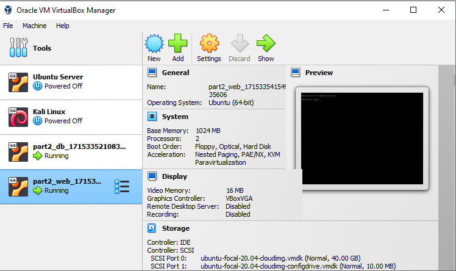
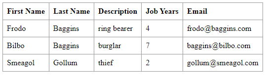
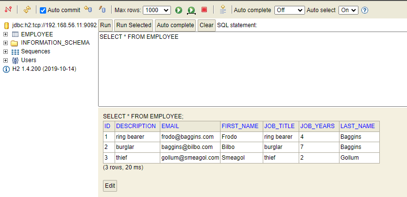

# DevOps Technical Report | Class Assignment 3 - Part 2

## Part 2 - Virtualization with Vagrant using VirtualBox

### Introduction

The purpose of this part of the assignment is to use Vagrant to automatically generate two virtual machines,
one for the webServer and the other for the database.

### Requirements

1. Copy a Vagrantfile to the repository and update it to generate two virtual machines through VirtualBox.
2. Run command `vagrant up` to create the virtual machines and run the application, automatically.
3. Verify that the web application is accessible from the browser in the host machine.
4. Verify that the H2 console is accessible from the browser in the host machine, and has a connection to the H2 server.

### Analysis

1. Install Vagrant locally.
2. Copy the Vagrantfile to the repository.
3. Update the Vagrantfile to be compatible with the current project.
4. Run the command `vagrant up` to create the virtual machines and run the application.
5. Access the web application from the browser in the host machine.
6. Access the H2 console from the browser in the host machine.

### Implementation

1. Install Vagrant locally.

2. Copy the Vagrantfile to the repository from https://bitbucket.org/pssmatos/vagrant-multi-spring-tut-demo/src/master/.

3. Update the Vagrantfile to be compatible with the current project.

```Vagrantfile
    Vagrant.configure("2") do |config|
        config.vm.box = "ubuntu/focal64"
        config.ssh.insert_key = false
        # This provision is common for both VMs
        config.vm.provision "shell", inline: <<-SHELL
            sudo apt-get update -y
            sudo apt-get install -y iputils-ping avahi-daemon libnss-mdns unzip \
                openjdk-17-jdk-headless
        # ifconfig
        SHELL
        #============
        # Configurations specific to the database VM
        config.vm.define "db" do |db|
            db.vm.box = "ubuntu/focal64"
            db.vm.hostname = "db"
            db.vm.network "private_network", ip: "192.168.56.11"
        # We want to access H2 console from the host using port 8082
        # We want to connet to the H2 server using port 9092
            db.vm.network "forwarded_port", guest: 8082, host: 8082
            db.vm.network "forwarded_port", guest: 9092, host: 9092
        # We need to download H2
            db.vm.provision "shell", inline: <<-SHELL
            wget https://repo1.maven.org/maven2/com/h2database/h2/1.4.200/h2-1.4.200.jar
        SHELL
        # The following provision shell will run ALWAYS so that we can execute the H2 server process
        # This could be done in a different way, for instance, setting H2 as as service, like in the following link:
        # How to setup java as a service in ubuntu: http://www.jcgonzalez.com/ubuntu-16-java-service-wrapper-example
        #
        # To connect to H2 use: jdbc:h2:tcp://192.168.33.11:9092/./jpadb
        db.vm.provision "shell", :run => 'always', inline: <<-SHELL
            java -cp ./h2*.jar org.h2.tools.Server -web -webAllowOthers -tcp -tcpAllowOthers -ifNotExists > ~/out.txt &
        SHELL
        end
        #============
        # Configurations specific to the webserver VM
        config.vm.define "web" do |web|
            web.vm.box = "ubuntu/focal64"
            web.vm.hostname = "web"
            web.vm.network "private_network", ip: "192.168.56.10"
        # We set more ram memmory for this VM
            web.vm.provider "virtualbox" do |v|
                v.memory = 1024
        end
        # We want to access tomcat from the host using port 8080
        web.vm.network "forwarded_port", guest: 8080, host: 8080
        web.vm.provision "shell", inline: <<-SHELL, privileged: false
            # sudo apt-get install git -y
            # sudo apt-get install nodejs -y
            # sudo apt-get install npm -y
            # sudo ln -s /usr/bin/nodejs /usr/bin/node
            sudo apt install -y tomcat9 tomcat9-admin
            # If you want to access Tomcat admin web page do the following:
            # Edit /etc/tomcat9/tomcat-users.xml
            # uncomment tomcat-users and add manager-gui to tomcat user
            # Change the following command to clone your own repository!
            git clone https://github.com/diogo-m-oliveira/devops-23-24-JPE-1140500.git
            cd devops-23-24-JPE-1140500/ca2/part2
            chmod u+x gradlew
            ./gradlew clean build
            nohup ./gradlew bootRun > /home/vagrant/spring-boot-app.log 2>&1 &
            # To deploy the war file to tomcat9 do the following command:
            # sudo cp ./build/libs/basic-0.0.1-SNAPSHOT.war /var/lib/tomcat9/webapps
        SHELL
      end
    end
```

4. Run the command `vagrant up` to create the virtual machines and run the application.
    * After the command is executed, the virtual machines are created via VirtualBox.
      
      

5. Access the web application from the browser in the host machine.
    * Open the web browser in http://192.168.56.10:8080/basic-0.0.1-SNAPSHOT/.
      

6. Access the H2 console from the browser in the host machine.
    * Open the web browser in localhost:8082.
    * Use the following connection settings:
        * Driver Class: org.h2.Driver
        * JDBC URL: jdbc:h2:tcp://192.168.56.11:9092/./jpadb
        * User Name: sa
    * Check if the table Employee is created.

   
   

## Part 2 - Virtualization with Vagrant - Alternative to VirtualBox

### Introduction

The purpose of this part of the assignment is to use Vagrant to automatically generate two virtual machines,
one for the webServer and the other for the database, using VMware Workstation as an alternative to VirtualBox.

### Requirements

1. Update the Vagrantfile to use VMware Workstation as the provider.
2. Run command `vagrant up` to create the virtual machines and run the application, automatically.

### Implementation

To implement this part of the assignment, we need to update the Vagrantfile to use VMware Workstation as the provider.

```Vagrantfile
   Vagrant.configure("2") do |config|
      config.vm.provider "vmware_workstation" do |v|
      v.vmx["memsize"] = "2048" # Adjust memory size as needed
      v.vmx["numvcpus"] = "2"   # Adjust number of CPUs as needed
   end
   config.vm.box = "ubuntu/focal64"
   config.ssh.insert_key = false
   # This provision is common for both VMs
   config.vm.provision "shell", inline: <<-SHELL
      sudo apt-get update -y
      sudo apt-get install -y iputils-ping avahi-daemon libnss-mdns unzip \
         openjdk-17-jdk-headless
      # ifconfig
   SHELL
   #============
   # Configurations specific to the database VM
      config.vm.define "db" do |db|
         db.vm.provider "vmware_workstation" do |v|
            v.vmx["memsize"] = "2048" # Adjust memory size as needed
            v.vmx["numvcpus"] = "1"   # Adjust number of CPUs as needed
         end
         db.vm.box = "ubuntu/focal64"
         db.vm.hostname = "db"
         db.vm.network "private_network", ip: "192.168.56.11"
         # We want to access H2 console from the host using port 8082
         # We want to connet to the H2 server using port 9092
         db.vm.network "forwarded_port", guest: 8082, host: 8082
         db.vm.network "forwarded_port", guest: 9092, host: 9092
         # We need to download H2
         db.vm.provision "shell", inline: <<-SHELL
            wget https://repo1.maven.org/maven2/com/h2database/h2/1.4.200/h2-1.4.200.jar
         SHELL
         # The following provision shell will run ALWAYS so that we can execute the H2 server process
         # This could be done in a different way, for instance, setting H2 as as service, like in the following link:
         # How to setup java as a service in ubuntu: http://www.jcgonzalez.com/ubuntu-16-java-service-wrapper-example
         #
         # To connect to H2 use: jdbc:h2:tcp://192.168.33.11:9092/./jpadb
         db.vm.provision "shell", :run => 'always', inline: <<-SHELL
            java -cp ./h2*.jar org.h2.tools.Server -web -webAllowOthers -tcp -tcpAllowOthers -ifNotExists > ~/out.txt &
         SHELL
      end
      #============
      # Configurations specific to the webserver VM
      config.vm.define "web" do |web|
         web.vm.provider "vmware_workstation" do |v|
            v.vmx["memsize"] = "2048" # Adjust memory size as needed
            v.vmx["numvcpus"] = "2"   # Adjust number of CPUs as needed
         end
         web.vm.box = "ubuntu/focal64"
         web.vm.hostname = "web"
         web.vm.network "private_network", ip: "192.168.56.10"
         # We want to access tomcat from the host using port 8080
         web.vm.network "forwarded_port", guest: 8080, host: 8080
         web.vm.provision "shell", inline: <<-SHELL, privileged: false
            # sudo apt-get install git -y
            # sudo apt-get install nodejs -y
            # sudo apt-get install npm -y
            # sudo ln -s /usr/bin/nodejs /usr/bin/node
            sudo apt install -y tomcat9 tomcat9-admin
            # If you want to access Tomcat admin web page do the following:
            # Edit /etc/tomcat9/tomcat-users.xml
            # uncomment tomcat-users and add manager-gui to tomcat user
            # Change the following command to clone your own repository!
            git clone https://github.com/diogo-m-oliveira/devops-23-24-JPE-1140500.git
            cd devops-23-24-JPE-1140500/ca2/part2
            chmod u+x gradlew
            ./gradlew clean build
            nohup ./gradlew bootRun > /home/vagrant/spring-boot-app.log 2>&1 &
            # To deploy the war file to tomcat9 do the following command:
            # sudo cp ./build/libs/basic-0.0.1-SNAPSHOT.war /var/lib/tomcat9/webapps
         SHELL
      end
   end
```

After updating the Vagrantfile, run the command `vagrant up` to create the virtual machines and run the application.

* After the command is executed, the virtual machines are created via VMware Workstation.

### Conclusion

In this part of the assignment, we used Vagrant to automatically generate two virtual machines, one for the webServer and the other for the database. We used VirtualBox and VMware Workstation as providers to create the virtual machines. We accessed the web application from the browser in the host machine and the H2 console from the browser in the host machine. The H2 console had a connection to the H2 server.