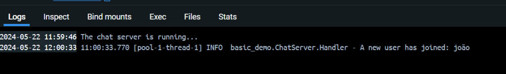
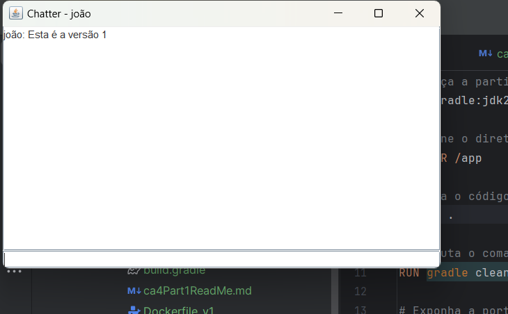
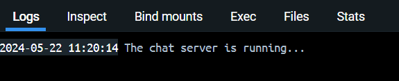
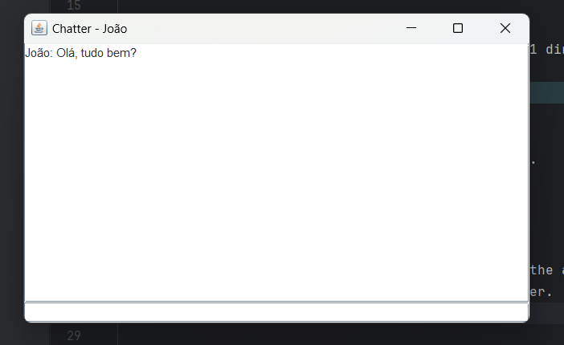

# DevOps Technical Report | Class Assignment 4 - Part 1

## Part 1 - Containers with Docker

### Introduction
The purpose of this class assignment is to demonstrate the use of Docker containers. Docker is a platform that allows developers to develop, ship, and run applications in containers.
The main goal is to execute the chat server in a container and connect to it from the host machine.

### Requirements
1. Clone the directory of CA2 part1 to the CA4 part1 directory.
2. Create a docker image to execute the chat server.
3. Tag the image and publish it in docker hub.
4. Run the client side in your host machine.
5. Mark your repository with the tag ca4-part1.

### Versions
1. Version 1: In this version you should build the chat server "inside" the Dockerfile.
2. Version 2: In this version you should build the chat server in your host computer and copy the jar file "into" the Dockerfile.

### Implementation
1. Clone the directory of CA2 part1 to the CA4 part1 directory.
```bash
mkdir -p ca4/part1
cp -r ca2/part1/* ca4/part1
```
#### Version 1

2. Create a docker image to build the chat server inside the DockerFile.
```dockerfile
# Começa a partir da imagem oficial do Gradle com OpenJDK 21
FROM gradle:jdk21

# Define o diretório de trabalho
WORKDIR /app

# Copia o código fonte para o diretório de trabalho
COPY . .

# Executa o comando de build do Gradle para compilar e construir a aplicação
RUN gradle clean build

# Exponha a porta que a aplicação irá usar
EXPOSE 59001

# Define o ponto de entrada que o Docker irá executar ao iniciar o container
ENTRYPOINT ["java", "-cp", "build/libs/basic_demo-0.1.0.jar", "basic_demo.ChatServerApp", "59001"]
```
3. Build the Dockerfile
```bash
docker build -t chat-server:v1 -f Dockerfilev1 . 
```
4. Run the Dockerfile
```bash
 docker run -p 59001:59001 chat-server:v1
```
5. Run the client side in your host machine
```bash
./gradlew runClient
```
* Server running Version 1
  

* Chat running Version 1
  

6. Tag the image and publish it in docker hub
* Login in Docker
```bash
docker login
```

* Tag the image
```bash
docker tag chat-server:v1 mane21/chat-server-v1
```
* Push the image
```bash
docker push mane21/chat-server-v1
```
* Now the image is available in here:
  https://hub.docker.com/u/mane21

#### Version 2
1. Create the Version 2:

```dockerfile
# Start from a base image with Java and Gradle installed
FROM gradle:jdk21

# Set the working directory in the container
WORKDIR /app

# Copy the jar file into the docker image
COPY build/libs/basic_demo-0.1.0.jar .

# Expose the port
EXPOSE 59001

# Run the Gradle task
CMD ["java", "-cp", "basic_demo-0.1.0.jar", "basic_demo.ChatServerApp", "59001"]
```

2. Build the Dockerfile
```bash
docker build -t chat-server:v2 -f Dockerfilev2 .
```

3. Run the Dockerfile
```bash
docker run -p 59001:59001 chat-server:v2
```

4. Run the client side in your host machine
```bash
./gradlew runClient
```

* Image of the running server in the container:



* Image of the running chat:



### Conclusion
In this assignment, we learned how to create a Docker image to run a chat server and connect to it from the host machine. We created two versions of the Dockerfile, one that builds the chat server inside the Dockerfile and another that copies the jar file into the Dockerfile. We also published the image in Docker Hub.