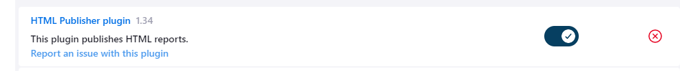

# CA5: Part2 README

## CI/CD Pipelines with Jenkins - Part 2

### Introduction
The goal of this assignment is to create a pipeline with Jenkins that builds a Docker image of the Spring Boot application and pushes it to Docker Hub.

### Requirements
You should define the following stages in your pipeline:
1. Checkout. To checkout the code from the repository
2. Assemble. Compiles and Produces the archive files with the application.
3. Test. Executes the Unit Tests and publish in Jenkins the Test results. See the junit
   step for further information on how to archive/publish test results.
4. Javadoc. Generates the javadoc of the project and publish it in Jenkins.
5. Archive. Archives in Jenkins the archive files (generated during Assemble, i.e., the war file)
6. Publish Image. Generate a docker image with Tomcat and the war file and publish it
   in the Docker Hub.

## CA5: Jenkins Steps

___

### 1. Creating a new Pipeline

#### 1.1. Click on new Item:


#### 1.2. Give the item a name and select the Pipeline option:


#### 1.3. In the Pipeline section of the setup, link the Pipeline to your git repository:

- 1.3.1. Change the Definition to Pipeline Script from SCM;
- 1.3.2. Change the SCM to git;
- 1.3.3. Input your own repository (use the actual directory for this ca5/part2);
- 1.3.4. Save;


### 2. Create the Jenkinsfile

### Implementation
1. Add a Jenkinsfile to the repository (in this case, ca5/part2). Make sure to correctly specify the branch
   and the URL of the repository in the 'Checkout' stage, and the directory of the gradlew script in the
   'Assemble', 'Test', and 'Javadoc' stages. Also, allow the execution of the
   gradlew script by changing the permissions of the file.
   Also, make sure the Docker Hub credentials ID and the Docker image name are correctly defined in the environment section
   (the docker image must be of format "YOUR-DOCKER-ID/IMAGENAME").

```groovy
pipeline {
    agent any

    environment {
        // Define Docker Hub credentials ID as configured in Jenkins credentials
        DOCKERHUB_CREDENTIALS = 'sabesquemeoboda'
        // Define the Docker image name
        IMAGE_NAME = "sabesquemeoboda/image-generated-with-jenkins"
    }

    stages {
        stage('Checkout') {
            steps {
                echo 'Checking out the code from the repository'
                git branch: 'main', url: 'https://github.com/diogo-m-oliveira/devops-23-24-JPE-1140500.git'
            }
        }

        stage('Assemble') {
            steps {
                         echo 'Assembling...'
                dir('ca2/part2') {
                    script {
                        // Ensure the Gradle Wrapper is executable (Unix) or available (Windows)
                        if (isUnix()) {
                            sh 'chmod +x ./gradlew'
                            sh './gradlew clean assemble -x test'
                        } else {
                            bat 'gradlew.bat clean assemble -x test'
                        }
                    }
                }
            }
            post {
                success {
                    // Archive the build artifacts
                    archiveArtifacts artifacts: '**/build/libs/*.jar', allowEmptyArchive: true
                }
            }
        }

        stage('Test') {
            steps {

                echo 'Testing...'
                dir('ca2/part2') {
                    script {
                        // Ensure the Gradle Wrapper is executable (Unix) or available (Windows)
                        if (isUnix()) {
                            sh './gradlew test'
                        } else {
                            bat 'gradlew.bat test'
                        }
                    }
                    // Publish JUnit test results
                    junit '**/build/test-results/test/*.xml'
                }
            }
            post {
                always {
                    // Archive the JUnit test results
                    junit '**/build/test-results/test/TEST-*.xml'
                }
            }
        }

        stage('Javadoc') {
            steps {

                echo 'Generating Javadoc...'
                dir('ca2/part2') {
                    script {
                        // Ensure the Gradle Wrapper is executable (Unix) or available (Windows)
                        if (isUnix()) {
                            sh './gradlew javadoc'
                        } else {
                            bat 'gradlew.bat javadoc'
                        }
                    }
                    // Archive and publish Javadoc
                    archiveArtifacts artifacts: '**/build/docs/javadoc/**', allowEmptyArchive: true
                    publishHTML target: [
                        allowMissing: false,
                        alwaysLinkToLastBuild: true,
                        keepAll: true,
                        reportDir: 'build/docs/javadoc',
                        reportFiles: 'index.html',
                        reportName: 'Javadoc Report'
                    ]
                }
            }
        }

        stage('Archive') {
            steps {

                echo 'Archiving...'
                dir('ca2/part2') {
                    // Archive build artifacts
                    archiveArtifacts artifacts: '**/build/libs/*.jar', allowEmptyArchive: true
                }
            }
        }

        stage('Publish Image') {
            steps {

                echo 'Publishing Docker image...'
                script {
                def dockerImage = docker.build("${IMAGE_NAME}:${env.BUILD_NUMBER}", '--progress=plain ca2/part2/')
                    docker.withRegistry('https://registry.hub.docker.com', DOCKERHUB_CREDENTIALS) {

                        dockerImage.push()
                    }
                }
            }
        }
    }

    post {
        always {
            cleanWs()
        }
    }
}
```

2. In Jenkins, add your Docker credentials to Jenkins. Go to 'Manage Jenkins' -> 'Manage Credentials' -> 'Global credentials' -> 'Add Credentials'.
   Select 'Username with password' as the kind, enter your Docker Hub username and password, and give it an ID.

    

3. Install the 'Docker Pipeline', 'Docker', and 'HTML Publisher' plugins in Jenkins.
   Go to 'Manage Jenkins' -> 'Manage Plugins' -> 'Available' -> search for the plugins and click -> install.

- 1. Install the Javadoc Plugin in Jenkins:
     

- 2. Install the Docker Pipeline Plugin in Jenkins:
     

- 3. Install the Docker Plugin in Jenkins:
     

- 4. Install the HTML Publisher Plugin in Jenkins:
     


4. Add the Dockerfile to the repository (in this case, ca2/part2).
```dockerfile
FROM tomcat:9-jdk17-openjdk

COPY ./build/libs/*.jar /usr/local/tomcat/webapps/

EXPOSE 8080
```

5. Run the pipeline and verify that the stages are executed correctly (console output).

   

6. Verify that the Docker image was pushed to Docker Hub.

   


