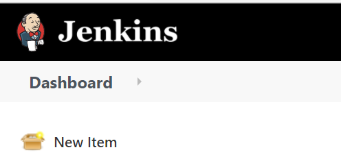
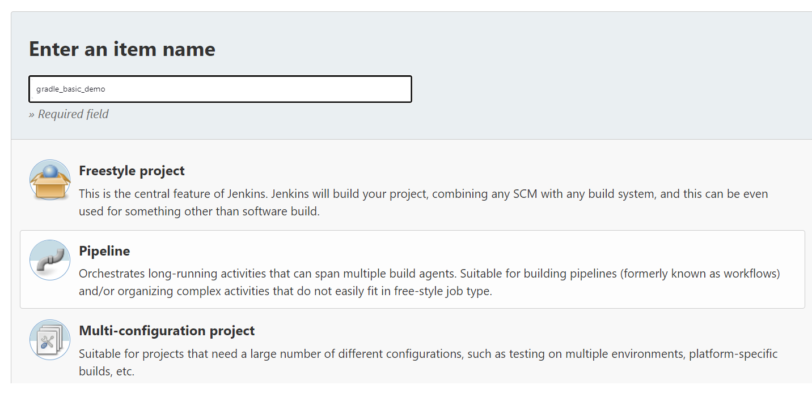
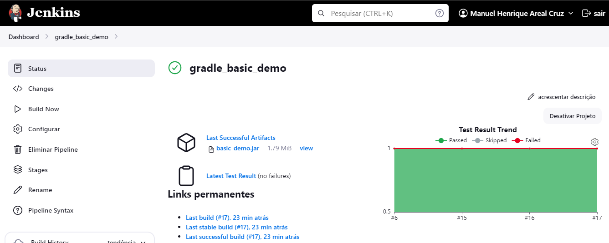
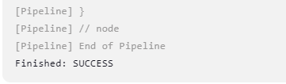

# CA5: Part1 README

The Readme is structure in 1 section:

- **Jenkins Steps** This part of CA5 focuses on applying Continuous Integration and Delivery using Jenkins;

## CA5: Jenkins Steps

___

### 0. Install jenkins

#### 0.1. Follow the steps on the jenkins website:

[Installing Jenkins](https://www.jenkins.io/doc/book/installing/)

#### 0.2. Check to see if you have jenkins running locally:

If you didn't specify anything different from the basic setup head on to

```localhost:6969```

### 1. Creating a new Pipeline

#### 1.1. Click on new Item:



#### 1.2. Give the item a name and select the Pipeline option:



#### 1.3. In the Pipeline section of the setup, link the Pipeline to your git repository:

- 1.3.1. Change the Definition to Pipeline Script from SCM;
- 1.3.2. Change the SCM to git;
- 1.3.3. Input your own repository (use the actual directory for this CA5/Part2);
- 1.3.4. Save;


### 2. Create the Jenkinsfile

First, copy the CA2/Part1 project to the current folder, as it might need some adaptations to work.

Then let's go through the example Jenkinsfile provided by in the lecture:

```
pipeline {
    agent any

    stages {
        stage('Checkout') {
            steps {
                echo 'Checking out the code from the repository'
                git branch: 'main', url: 'https://github.com/manuelcruz98/devops-23-24-JPE-1231841.git'
            }
        }
        stage('Assemble') {
            steps {
                echo 'Assembling...'
                dir('ca2/part1') {
                    sh 'chmod +x ./gradlew'
                    sh './gradlew clean assemble'
                }
            }
        }
        stage('Test') {
            steps {
                echo 'Testing...'
                dir('ca2/part1') {
                    sh './gradlew test'
                    junit 'build/test-results/test/*.xml'
                }
            }
        }
        stage('Archive') {
            steps {
                echo 'Archiving...'
                dir('ca2/part1') {
                    archiveArtifacts 'build/libs/*.jar'
                }
            }
        }
    }
}
```

#### 2.2. Push the changes to the remote directory!

___

### 3. Run the Pipeline

#### 3.1. Click the Build Now button:





## We are done with Part1 of the Assignment!

*To preserve the original Jenkinsfile used for this assignment, it was saved in the Archive folder. This step is crucial
because the Jenkinsfile located in the root directory of the repository will have to be modified for the second part of
the CA5 assignment.*


